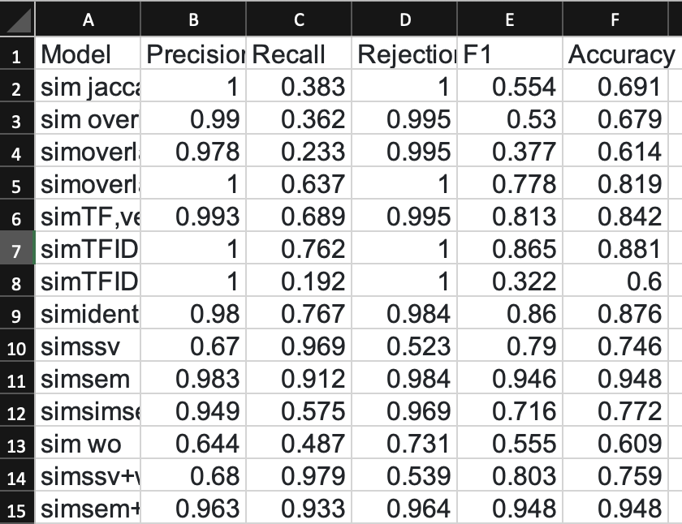

# Solution-TOPSIS-Method-for-Selecting-a-Pre-trained-Model-in-Text-Sentence-Similarity
In this assignment, I will employ the TOPSIS method to choose the optimal pre-trained model for text sentence similarity using the TREC9 dataset. This dataset consists of 386 sentence pairs from original and paraphrased questions, with a vocabulary of 252 unique words (84.5% uniqueness), and an average sentence length of 39.35 characters. The dataset complexity is evident in its diverse paraphrasing categories. The evaluation involves 14 models assessed on five parameters: Precision, Recall, Rejection Rate, and Accuracy.

